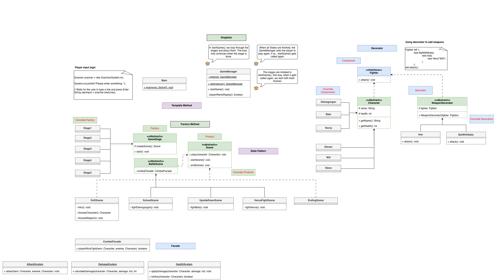

# Stranger-Things-TFG

🚨Link to the GitHub repository: https://github.com/MiguelBrugge-HZ/Stranger-Things-TFG

## Teamwork & Contributions
This project was developed collaboratively by two team members:
- **Miguel Brugge**
- **Xue Hu**

At the start of the project, we focused on coming up with a suitable idea for the game. We brainstormed several concepts, and after a few days we discussed the Netflix series Stranger Things. Because this series is a shared interest, we decided to base our game on its theme and atmosphere. Together, we discussed how the game mechanics would work and created a storyboard to visualize the gameplay and flow of the game.


Next, we both worked on designing the class diagram. Each of us initially created our own simple diagrams based on our ideas. Miguel then combined these ideas into a complete class diagram and further refined it based on feedback from Xue. This ensured that the overall design was well-structured before implementation.

After finalizing the class diagram, we both implemented it into the codebase. During development, we noticed that the original class diagram was not perfect and needed some adjustments. While some design decisions were changed along the way, most of the structural elements of the class diagram remained valid and were successfully used in the final implementation.

Towards the end of the project, we worked together on balancing the gameplay. We adjusted values such as player health and enemy damage, as the game initially felt too difficult and the player character died too quickly.
### Class Diagram


## Creational Design Pattern

### 1. Singleton

In this game, the Singleton pattern is used to make sure that there is only one `GameManager` controlling the game flow and one `InputManager` handling all console input.

`GameManager` manages the entire game process, including starting the game, progressing through stages, and restarting the game when the player chooses to replay.

`InputManager` handles all user input using a single `Scanner` instance. This avoids creating multiple `Scanner` objects for `System.in` and keeps input behavior consistent during character selection, combat, and replay.

Because the game runs in a linear flow with multiple stages, combat rounds, and replay functionality, having multiple instances of these classes would lead to inconsistent game state and duplicated input handling. The Singleton pattern ensures that a single shared instance is used throughout the game.

---

### Implementation

#### GameManager: Controls the overall game flow
- Starts the game
- Progresses through multiple stages
- Handles character selection
- Restarts the game when the player chooses to replay

```java
public class GameManager {
    private static GameManager instance;

    private GameManager() {}

    public static GameManager getInstance() {
        if (instance == null) {
            instance = new GameManager();
        }
        return instance;
    }
}
```

#### InputManager: centralize all console input.
```java
public class InputManager {
    private static InputManager instance;
    private final Scanner scanner;

    private InputManager() {
        scanner = new Scanner(System.in);
    }

    public static InputManager getInstance() {
        if (instance == null) {
            instance = new InputManager();
        }
        return instance;
    }
}
```

## Creational Design Pattern
### 2. Factory Method

In this game, the Factory Method pattern is used to create different types of game scenes, the main game flow doesn't need to know the exact scene classes.

The `GameStage` class defines a method for creating a `Scene`, but does not decide which specific scene is created. Each concrete stage is responsible for providing its own scene implementation. This allows the game to add new stages and scenes without changing the core game logic.

---

### Implementation

#### GameStage

`GameStage` defines the factory method `createScene()` and contains the shared logic for starting a stage.

```java
public abstract class GameStage {
    abstract Scene createScene();
    public Character start(Character player) {
        Scene scene = this.createScene();
        scene.setPlayer(player);
        System.out.println();
        return scene.play();
    }
}
```

#### Stage1
`Stage1` overrides the factory method `createScene()` to create a DnDScene.
```java
public class Stage1 extends GameStage {
    @Override
    Scene createScene() { return new DnDScene(); }
}
```

## Structural Design Pattern

### 1. Decorator

In this game, the Decorator pattern is used to add weapons to a character during gameplay without modifying the original character classes.

Base characters such as `Eleven` are created first. During the stage, the player chooses a weapon. That weapon is applied by wrapping the existing character with a weapon decorator. This allows the character to gain new moves while keeping the original character implementation unchanged.

Using the Decorator pattern avoids creating many subclasses such as `ElevenWithBat` or `ElevenWithHammer` and makes it easy to add new weapons in the future.

---

### Implementation
#### CharacterDecorator: It copies the existing character’s state (name, health, moves) and allows subclasses to extend or modify behavior.

```java
public abstract class CharacterDecorator extends Character {

    protected final Character wrapped;

    protected CharacterDecorator(Character wrapped) {
        super(wrapped.getName(), 0, wrapped.getMoves());
        this.wrapped = wrapped;
    }

    @Override
    public int getHealth() {
        return wrapped.getHealth();
    }

    @Override
    public void setHealth(int health) {
        wrapped.setHealth(health);
    }

    @Override
    public boolean isAlive() {
        return wrapped.isAlive();
    }
}
```

#### BatDecorator: Adding bat weapon to a character by introducing a new attack move.

```java
public class BatDecorator extends CharacterDecorator {

    public BatDecorator(Character wrapped) {
        super(wrapped);
        moves.add(new Move("🏏 Bat Slash", 14, 30, 0.85));
    }

    @Override
    public String toString() {
        return "Bat";
    }

    @Override
    public String getName() {
        return wrapped.getName() + " with Bat";
    }
}
```

#### Using the Decorator Pattern in Gameplay: During gameplay, the player can choose a weapon for their character. The chosen weapon is applied by wrapping the existing character with a corresponding decorator:

```java
private Character chooseWeapon(Character player) {
    List<String> weapons = List.of("Bat", "Hammer");

    InputManager input = InputManager.getInstance();
    String choice = input.chooseOption("Choose your weapon:", weapons);

    return switch (choice) {
        case "Bat" -> new BatDecorator(player);
        case "Hammer" -> new HammerDecorator(player);
        default -> player;
    };
}

```

## Structural Design Pattern

### 2. Facade
In this game, the Facade pattern is used to simplify the combat system by providing a single entry point for handling fights between characters.

Combat involves multiple responsibilities such as:
- Checking whether characters are alive
- Applying damage
- Executing attack moves
- Logging combat actions and results

Instead of letting stages or scenes manage these details directly, all combat-related logic is encapsulated in the `CombatFacade` class. This keeps the game flow clean. 
Scenes only need to call one method to start a fight, without knowing how damage, health, or logging are handled internally.

---

### Implementation
#### CombatFacade: a single entry point for managing combat

`CombatFacade` combine multiple subsystems and exposes `fight()` method to the rest of the game.

```java
public class CombatFacade {
    private final HealthSystem healthSystem = new HealthSystem();
    private final CombatLogger logger = new CombatLogger();

    public void fight(Character player, Character enemy) {
        System.out.println("Combat starts: " + player.getName() + " ⚔️ " + enemy.getName());

        while (player.isAlive() && enemy.isAlive()) {
            executeTurn(player, enemy);
            if (!enemy.isAlive()) break;

            executeTurn(enemy, player);
        }

        Character winner = player.isAlive() ? player : enemy;
        logger.logWinner(winner);
    }

    private void executeTurn(Character attacker, Character defender) {
        Move move = attacker.chooseMove();
        System.out.println(attacker.getName() + " uses " + move.getName());

        int damage = move.execute();
        if (damage > 0) {
            healthSystem.applyDamage(defender, damage);
        } else {
            System.out.println(attacker.getName() + "'s attack missed!💨");
        }

        logger.logAttack(attacker, defender, damage);
        System.out.println();
    }
}
```

#### HealthSystem: handles health and damage logic
```java
public class HealthSystem {

    public void applyDamage(Character target, int damage) {
        int newHealth = target.getHealth() - damage;
        target.setHealth(Math.max(newHealth, 0));
    }
}
```

#### CombatLogger: responsible for combat output
```java
public class CombatLogger {

    public void logAttack(Character attacker, Character defender, int damage) {
        System.out.println(attacker.getName() + " deals " + damage +
                " 💥 damage ➡️ " + defender.getName());
        System.out.println(defender.getName() + " ❤️: " + defender.getHealth());
    }

    public void logWinner(Character winner) {
        System.out.println(winner.getName() + " wins the fight!🎖️");
    }
}
```

#### Move: encapsulates attack behavior
```java
public class Move {
    private final String name;
    private final int minDamage;
    private final int maxDamage;
    private final double hitChance; // 0.0 to 1.0

    private static final Random RANDOM = new Random();

    public Move(String name, int minDamage, int maxDamage, double hitChance) {
        this.name = name;
        this.minDamage = minDamage;
        this.maxDamage = maxDamage;
        this.hitChance = hitChance;
    }

    public String getName() {
        return name;
    }

    public int execute() {
        if (RANDOM.nextDouble() <= hitChance) {
            return RANDOM.nextInt(maxDamage - minDamage + 1) + minDamage;
        } else {
            return 0;
        }
    }

    @Override
    public String toString() {
        return name + " (Damage: " + minDamage + "-" + maxDamage + ", Hit chance: " + (int)(hitChance*100) + "%)";
    }
}
```


## Behavioral Design Pattern

### 1. State
In this game, the State pattern is applied through the scene system.  
Each game scene represents a different state of the game, and encapsulates the behavior that is specific to that stage.

Instead of using large conditional statements (such as `if` or `switch`) in the `GameManager` to control game flow, the behavior of the game changes naturally by switching between different `Scene` objects.

This makes the game flow easier to extend and maintain, as new scenes (states) can be added without modifying existing control logic.

- **State interface**: `Scene`
- **Concrete States**: `DnDScene`, `SchoolScene`, `UpsideDownScene`, `VecnaFightScene`
- **Context**: `GameStage`
---

### Implementation
#### Scene

The `Scene` class defines the common interface for all game states.  
Each concrete scene must implement its own behavior.

```java
public abstract class Scene {
    protected Character player;
    protected abstract void startScene();
    protected abstract void endScene();

    public void setPlayer(Character player) {
        this.player = player;
    }

    public Character play() {
        startScene();
        endScene();
        return player;
    }
}
```

#### DnDScene(Concrete State Example): Each scene controls its own behavior and does not rely on external condition checks to decide what should happen next.

```java
public class DnDScene extends Scene{
    @Override
    public void startScene() {
        new DnDIntroDialog().play();
    }

    private Character chooseWeapon(Character player) {
        List<Character> weaponChoices = List.of(
                new BatDecorator(player),
                new HammerDecorator(player)
        );

        InputManager input = InputManager.getInstance();
        return input.chooseOption("Choose your weapon:", weaponChoices);
    }

    @Override
    public void endScene() {
        new SchoolTransitionDialog().play();
        player = chooseWeapon(player);
    }
}
```

#### GameStage: It decides which Scene (state) is active, but does not know the internal details of that scene.

```java
public abstract class GameStage {
    abstract Scene createScene();
    public Character start(Character player) {
        Scene scene = this.createScene();
        scene.setPlayer(player);
        System.out.println();
        return scene.play();
    }
}

```

## Behavioral Design Pattern

### 2. Template Method
The **Template Method** pattern is a **behavioral design pattern** that defines a **skeleton of an algorithm** in a base class while letting subclasses **override specific steps**.  

In our game, the **Template Method is implemented in `Scene.play()`**, which controls the internal flow of a scene.  

`GameStage` does not implement a Template Method itself but **orchestrates stage execution** by creating a `Scene` and calling its `play()` method. This separation ensures that the **overall stage flow remains consistent**, while each scene can provide **unique behavior**.

The `play()` method defines the **fixed sequence of steps**:

1. **Start the scene** (`startScene()`) — customizable by subclasses  
2. **End the scene** (`endScene()`) — customizable by subclasses  
3. **Return the player** — fixed step

Key points:

- **Fixed steps:** The sequence of method calls (`startScene()` → `endScene()` → return `player`) **cannot be changed by subclasses**, ensuring consistency.  
- **Customizable steps:** Subclasses implement `startScene()` and `endScene()` to provide **scene-specific behavior**.  
- **Decoupling:** `Scene` controls the internal flow, while `GameStage` decides **which scene to run**, keeping concerns separate.  
- **Extensibility:** Adding a new scene requires only implementing `startScene()` and `endScene()`, without changing existing code.

This design allows all scenes to **follow the same overall flow** while providing the **flexibility to customize behavior** for each scene.

---

### Implementation

#### Scene: Template Method Implementation

```java
public abstract class Scene {
    protected Character player;
    protected abstract void startScene();
    protected abstract void endScene();

    public Character play() {
        startScene();
        endScene();
        return player;
    }
}
